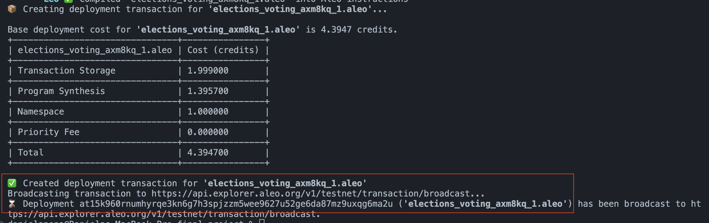
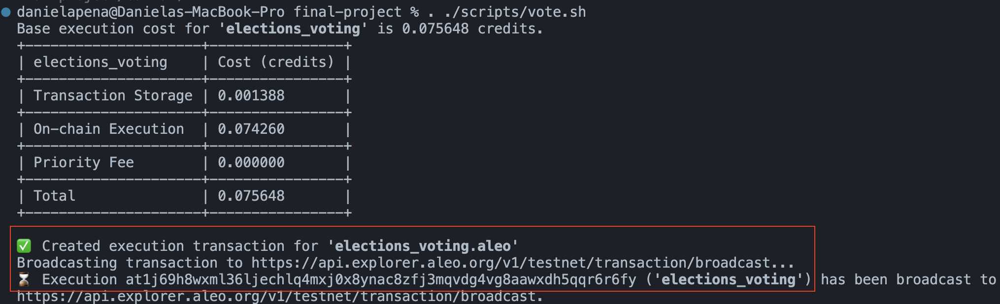
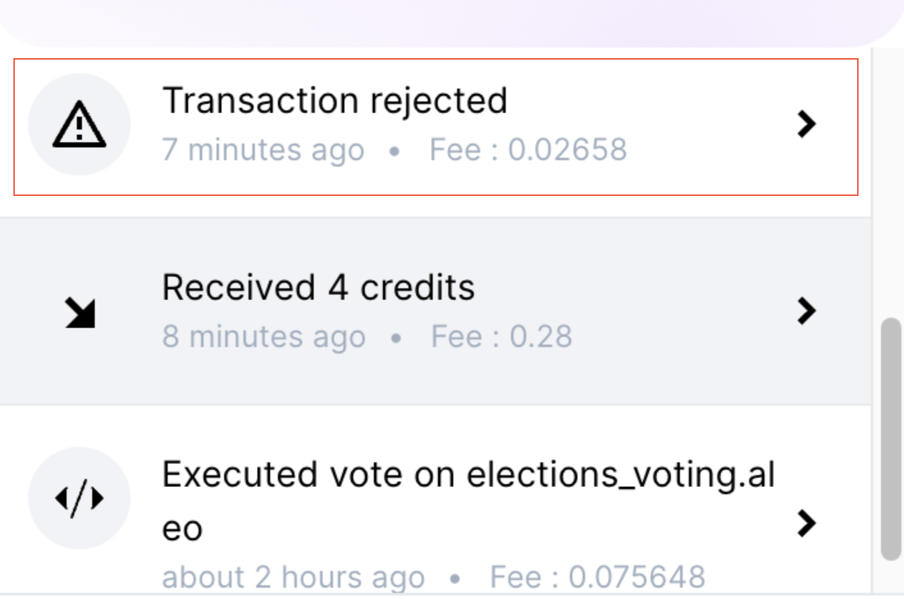
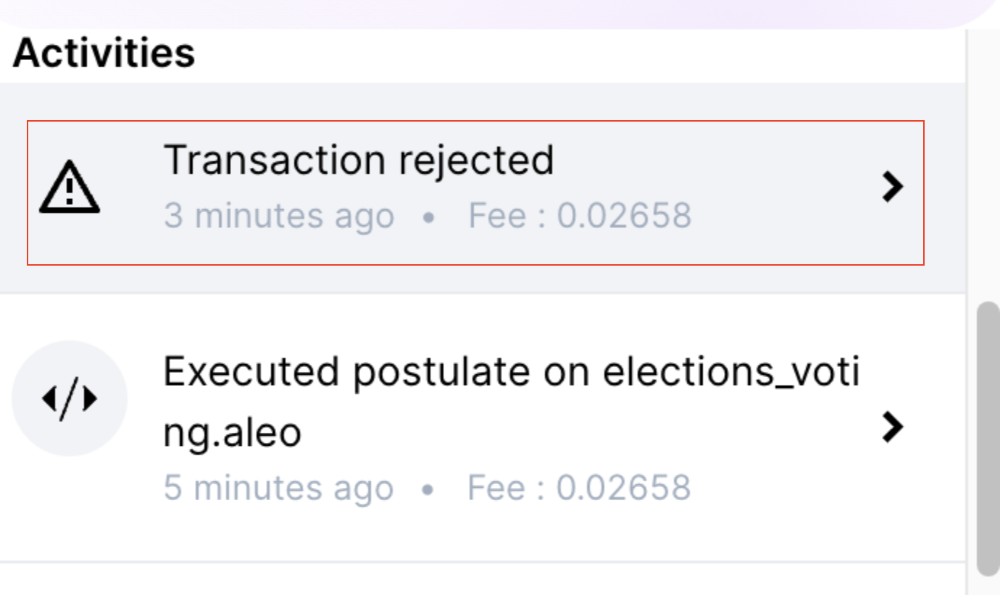

# FinalProject - Anonymous Voting System using Aleo Protocol

Welcome to the Anonymous Voting System, a decentralized application built on the Aleo protocol. This system leverages the power of zero-knowledge proofs to ensure that votes are cast and counted in a secure, private, and verifiable manner. By using the Aleo protocol, we can provide a voting solution that maintains the confidentiality of each vote while ensuring the integrity and transparency of the overall election process.

This project is the final project of the ZK Bootcamp Q2 2024, showcasing the practical application of zero-knowledge proofs learned during the bootcamp.

## Features

- Postulate as a candidate
- Vote anonymously only once

## Try out

Use <https://explorer.aleo.org> to view deployment transaction details

**Important**: Replace variables with correct inputs of your wallet before running scripts.

### Prerequisites

- Install Leo, Rust, SnarkOS <https://developer.aleo.org/leo/installation#1-install-the-prerequisites>
- Make sure to fund the leo wallet <https://www.leo.app/blog/aleo-faucet>.


### Deploy

```bash
leo deploy --network testnet
```

### Vote

You can only vote once, and the candidate must be postulated, otherwise the execution will fail.

```bash
. ./scripts/vote.sh
```

### Postulate

You can only postulate once, otherwise the execution will fail.

```bash
. ./scripts/postulate.sh
```

## Demo examples

- Deployed program: <https://explorer.aleo.org/transaction/at1lmq676mfdt67r6htxkyre8ussn5s3ajcvyhqehqedmzpx35mmvxsknk9qg?tab=overview>



- Postulate: <https://explorer.aleo.org/transaction/at17h78ftt5c0f286r86lzucmaaxlfqcqz2qw4zh2lpnhpaupqxjuqqmj3w5t>

- Vote: <https://explorer.aleo.org/transaction/at1f5v4qf3p740j7n03mvrwzek6umg9ymk884cwccv79epaw4lk5u9symflry?tab=transitions>



- Duplicated vote constraint



- Duplicated postulation constraint



## Limitations encountered

- The vsCode extension seems to be using an older version of the leo language so it lints the syntax like `async` or suggest using `finalize` when this seems to be no longer supported.

- The language seems very restrictive, so struggled when trying to include features like tally votes or others because we couldn't easily iterate. Maybe this is intended for the purpose of the program's logic.
